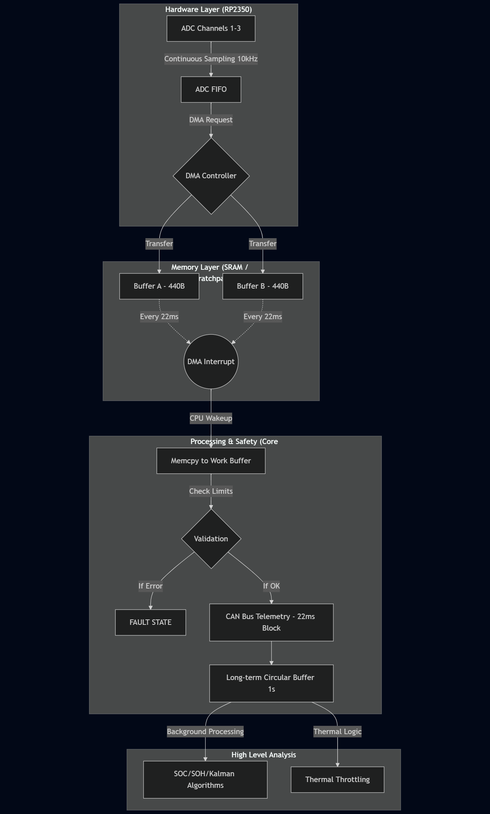

# Project: Main BMS Firmware Development (RP2350)
**Role:** Safety-Critical Systems Engineer  
**Status:** High Priority / Safety Critical

---

## 1. Εισαγωγή & Σκοπός
Το παρόν έγγραφο ορίζει τις προδιαγραφές για την ανάπτυξη του firmware του κεντρικού BMS (Master) για το ηλεκτροκίνητο μονοθέσιο. Το σύστημα βασίζεται στον **RP2350** και αποτελεί το κρισιμότερο επίπεδο ασφαλείας της μπαταρίας. 

> [!CAUTION]
> **Κρισιμότητα Συστήματος**
>
> Ο κώδικας πρέπει να είναι "αλεξίσφαιρος" (bulletproof), ντετερμινιστικός και να ακολουθεί αυστηρά το **[JPL Institutional Coding Standard](https://yurichev.com/mirrors/C/JPL_Coding_Standard_C.pdf)**. Κάθε αστοχία μπορεί να θέσει σε κίνδυνο την ακεραιότητα της μπαταρίας και του οδηγού.

---

## 2. Αρχιτεκτονική Συστήματος & I/O
Το BMS Master καλείται να διαχειριστεί τις εξής διεπαφές:
* **Satellite Communication:** Διασύνδεση με 9 modules μέσω I2C (Differential). Ανάγνωση 144 τάσεων και 144 θερμοκρασιών.
* **External Interface:** Σύνδεση με την Main ECU μέσω CAN Bus για αποστολή τηλεμετρίας.
* **Safety Loop:** Broken Cable Detection (Digital Input) που διατρέχει όλα τα modules και επιστρέφει στο Master.

## 3. Τεχνικές Προδιαγραφές & Διαχείριση Μνήμης

### Α. Στρατηγική Buffering (DMA Ping-Pong)
Για την αποφυγή απώλειας δεδομένων και τη βελτιστοποίηση της CPU, η δειγματοληψία του ADC (3 κανάλια, 10kHz) θα υλοποιηθεί ως εξής:
* **Block Size:** 440 Bytes ανά κανάλι (αντιστοιχεί σε 22ms δειγματοληψίας).
* **Ping-Pong Buffering:** Το DMA θα γράφει στον Buffer A, ενώ η CPU θα επεξεργάζεται τον Buffer B. 
* **Alignment:** Όλοι οι buffers πρέπει να είναι ευθυγραμμισμένοι (aligned) στη μνήμη για μέγιστη ταχύτητα μεταφοράς.

> [!NOTE]
> **Περιορισμός Μνήμης**
>
> **Static Allocation:** Απαγορεύεται αυστηρά η χρήση `malloc`. Όλη η μνήμη πρέπει να δεσμευτεί στατικά κατά το compile time, σύμφωνα με το JPL Rule #3.

### Β. Memory Mapping & Dual-Core Utilization
Ο RP2350 διαθέτει δύο πυρήνες. Προτείνεται ο εξής διαχωρισμός:
* **Core 0:** Low-level drivers (ADC, DMA, I2C, Interrupts).
* **Core 1:** Data processing (Error checking, Filtering, SOC calculation) και CAN Bus Stack.

---

## 4. Finite State Machine (FSM) & Λογική Λειτουργίας

Η χρήση μιας Πεπερασμένης Κατάστασης Μηχανής (FSM) είναι επιβεβλημένη για τη διασφάλιση του **ντετερμινισμού**. Το σύστημα δεν επιτρέπεται να βρίσκεται σε άγνωστη κατάσταση.

> [!IMPORTANT]
> **Λειτουργία FSM**
>
> * **Deterministic Transitions:** Κάθε μετάβαση (transition) πρέπει να πυροδοτείται από ένα συγκεκριμένο γεγονός (π.χ. Interrupt, CAN message).
> * **Safety First:** Οποιοδήποτε σφάλμα κατά τη διάρκεια των καταστάσεων STANDBY ή RUN οδηγεί ακαριαία στην κατάσταση **FAULT**.
> * **Latching Fault:** Στην κατάσταση FAULT, το σύστημα "κλειδώνει" την έξοδο ασφαλείας. Η έξοδος από αυτή την κατάσταση απαιτεί φυσικό Reset (Hard Reset), εμποδίζοντας την αυτόματη επανεκκίνηση του μονοθεσίου μετά από κρίσιμο σφάλμα.

## 5. Ανάλυση Αστοχιών (FMEA)

> [!WARNING]
> **Πρόβλεψη Σφαλμάτων**
>
> Ο προγραμματιστής οφείλει να υλοποιήσει τους παρακάτω μηχανισμούς ανίχνευσης:
>
> | Πιθανή Αστοχία   | Επίπτωση                                                             | Μηχανισμός Πρόληψης / Ανίχνευσης                                                            |
> | ---------------- | -------------------------------------------------------------------- | ------------------------------------------------------------------------------------------- |
> | I2C Bus Lock-up  | Loss of Monitoring (Critical). Αδυναμία ελέγχου τάσεων/θερμοκρασιών. | Hardware Watchdog & Bus Reset. Αν αποτύχει η επαναφορά εντός <50ms -> Immediate FAULT.      |
> | DMA Overrun      | Data Corruption / Λανθασμένη λήψη απόφασης ασφαλείας.                | Χρήση Double Buffering & DMA Interrupt Monitoring.                                          |
> | ADC Noise Spikes | False Trip (Άσκοπη διακοπή λειτουργίας).                             | Digital Filtering & Time-based validation (π.χ. σφάλμα αν η τιμή επιμένει για >3 δείγματα). |
> | CPU Hang         | Πλήρης απώλεια προστασίας μπαταρίας.                                 | Independent Hardware Watchdog (WDT).                                                        |

## 6. Παραδοτέα

1.  **M1: Memory & Logic Design:** Έγγραφο με το Memory Map, το Buffer Strategy και το State Machine (States: INIT, STANDBY, RUN, FAULT).
2.  **M2: Driver Layer:** Παραμετροποίηση ADC/DMA/PIO και επιβεβαίωση της σωστής ροής δεδομένων στους buffers.
3.  **M3: Communication & Safety:** Υλοποίηση I2C (Satellite polling) και Broken Cable detection.
4.  **M4: Final Integration:** CAN Bus Telemetry και πλήρης έλεγχος συμμόρφωσης με το JPL Standard.
5.  **M5: Data Processing & Analysis Algorithms**

  Στον Core 1, μετά τη συλλογή των ακατέργαστων δεδομένων, θα εκτελούνται οι παρακάτω αλγόριθμοι για την εκτίμηση της κατάστασης και την προστασία της μπαταρίας:

  - **Kalman Filtering**: Εφαρμογή φιλτραρίσματος στις μετρήσεις τάσης και ρεύματος για την εξάλειψη του θορύβου και την ακριβέστερη εκτίμηση των εσωτερικών καταστάσεων των κελιών.
  - **SOC (State of Charge) Estimation**: Συνδυασμός Coulomb Counting (για βραχυπρόθεσμη ακρίβεια) και Open Circuit Voltage (OCV) lookup tables (για διόρθωση drift), ώστε να γνωρίζουμε το ποσοστό ενέργειας.
  - **SOH (State of Health) Estimation**: Παρακολούθηση της εσωτερικής αντίστασης και της χωρητικότητας των κελιών σε βάθος χρόνου για την ανίχνευση υποβάθμισης.
  - **Thermal Throttling Logic**: Δυναμικός περιορισμός του μέγιστου επιτρεπόμενου ρεύματος (discharge current limit) βάσει των θερμοκρασιών που αναφέρουν τα SBMS, για την αποφυγή thermal runaway.
  - **Passive Cell Balancing Control**: Αλγόριθμος που αποφασίζει ποια κελιά πρέπει να εκφορτιστούν (μέσω των bleeding resistors στα SBMS) για την εξισορρόπηση των τάσεων κατά τη φόρτιση ή την ηρεμία.
  - **Plausibility Checks**: Σύγκριση της συνολικής τάσης του pack (από το Main ADC) με το άθροισμα των τάσεων των κελιών (από τα SBMS) για την ανίχνευση σφαλμάτων μέτρησης.
  - **Isolation Monitoring Interface**: Ανάγνωση δεδομένων από το IMD (Isolation Monitoring Device) για την ανίχνευση διαρροών προς το σασί.

---

## 7. Unit Testing & Validation Strategy

> [!NOTE]
> **Validation Requirement**
>
> Ο προγραμματιστής οφείλει να αποδείξει την ορθότητα του κώδικα μέσω των παρακάτω δοκιμών:

### Χρονική Ανάλυση (Timing Analysis)
- Block Timing: Χρήση παλμογράφου ή Logic Analyzer σε ένα GPIO (Toggle Pin) για να επιβεβαιωθεί ότι το DMA Interrupt συμβαίνει ακριβώς κάθε 22ms ($\pm 1\%$).
- Processing Latency: Μέτρηση του χρόνου που χρειάζεται ο Core 0 για το memcpy και το validation. Ο χρόνος αυτός πρέπει να είναι < 2ms για να μην καθυστερεί η επόμενη δειγματοληψία.
- CAN Transmission: Επιβεβαίωση ότι τα πακέτα CAN φεύγουν με το σωστό ρυθμό και δεν συσσωρεύονται στο transmit buffer.

### Προσομοίωση Σφαλμάτων (Fault Injection)
Πρέπει να ελεγχθεί η μετάβαση στο FAULT STATE για τις εξής περιπτώσεις:
- Broken Cable: Αποσύνδεση του καλωδίου κατά τη διάρκεια του RUN mode.
- I2C Timeout: Τεχνητή εισαγωγή καθυστέρησης (delay) στον driver του I2C για να προκληθεί timeout.
- Out-of-bounds: Παροχή τάσης > 4.2V ή < 2.5V (μέσω DC Power Supply ή εξομοιωτή) σε ένα κανάλι ADC.
- JPL Compliance Check: Static Analysis: Χρήση εργαλείων όπως το cppcheck ή το Clang Static Analyzer για τον εντοπισμό παραβιάσεων των κανόνων της JPL (π.χ. recursion, dynamic memory).
- Stack Usage: Μέτρηση του μέγιστου stack depth για να διασφαλιστεί ότι δεν υπάρχει κίνδυνος stack overflow στον RP2350.

---

> [!TIP]
> **Τελικός Έλεγχος**
>
> Η αποδοχή του έργου προϋποθέτει 0 warnings κατά το compile (-Wall -Wextra) και επιτυχή ολοκλήρωση του unit testing για τις συνθήκες σφάλματος.
